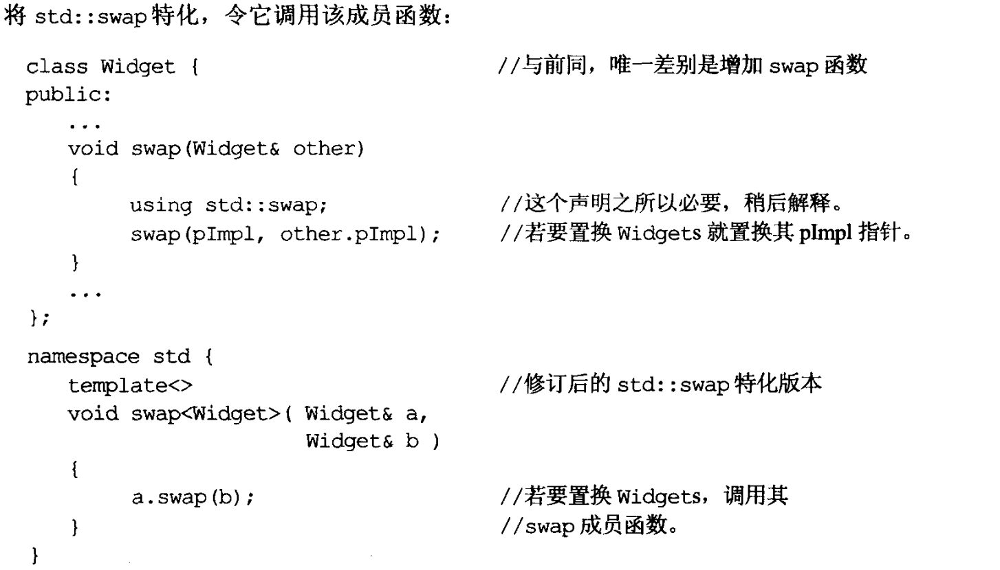
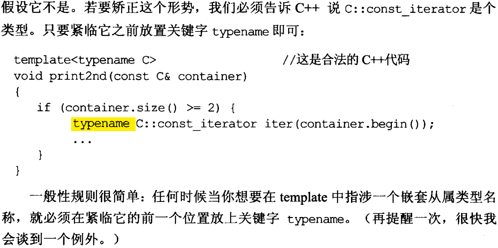

# Effective C++

## 条款3：尽可能使用const
* 可以为某个相同功能的函数声明2个const版本和非const版本，以应对不同目的调用。
* 令const版本调用非const版本是错误的。当你需要用一个const_cast将this的const性质解放，这预示着危险。为变量加上constness才是安全的。

## 条款4：确保变量使用之前已经被初始化
* 永远在使用对象之前确保其初始化。
* 当想要一个默认构造的变量时，显示指定nothing作为初始化参数。
* non-local static 对象的初始化顺序无法保证。当要使用时，利用函数调用返回,这就是将non-local static转换成local static。c++保证local static对象会在该函数被调用期间，首次遇上该对象之定义式时被初始化。
```
A& getA()
{
    static A a;
    return a;
}
```
* 避免代码重复的优秀做法是把共同的初始化代码放进一个初始化函数如init内。

## 条款5：了解C++默默编写并调用了哪些函数
* 编译器产出的析构函数是non-virtual的，除非这个class的base class自身声明有virtual析构函数（virtualness 主要来自于base class）
* 内涵const成员和reference的类，编译器无法生成copy assignment(kls:因此不要在类中使用reference和const成员。)
* kls:我的风格是，尽量使用编译器默认行为的BIG5，这样可以更多兼容STL)

## 条款7：为多态基类声明virtual析构函数
* 注意：标准string，STL容器是non-virtual dctor.禁止派生他们！
* 当希望定义一个纯虚class，但是没有pure virtual时可以考虑将析构函数定义为pure virtual。但要提供一个定义，因为子类析构会自用调用父类dctor，没有定义的话linker会报错。

## 条款9：绝不在构造和析构过程中调用virutal函数
* 根本原因derived class对象的构造base class构造期间，对象类型是base class。利用RTTI，得到的依旧是base class。

## 条款10：令operator= 返回 reference to *this
* 适用于`+= -= *=`等，这么做是为了支持连锁赋值`x = y = z = 10 `。所有内置类型和标准库均支持，所以还是随众吧。
* kls:标准定义如下：
```
A& operator=(const A& rhs)
{
    ...
    return *this;
}
```

## 条款11：令operator= 中处理“自我赋值”
* 同时使用证同测试+考虑异常安全。
```
A& A::operator=(const A& rhs)
{
    if (this == &rhs) return *this;

    delete pb;
    pb = new Bitmap(*rhs.pb); // 这里可能发生异常。一旦异常，pb却已经被delete。
    return *this;

}

A& A::operator=(const A& rhs)
{
    if (this == &rhs) return *this;

    Bitmap* pOrig = pb; //保存pb;
    pb = new Bitmap(*rhs.pb); // 这里可能发生异常。但不影响pb。
    delete pOrig;
    return *this;

}
```
## 条款13 复制对象时勿忘记其每一个成分
* 勿忘记复制derived class 的基类部分
* 拷贝构造与拷贝赋值互相调用均是不合理的！有一些看似能做到的语法，但是暗藏诸多风险。因此，为了节省代码，合理的做法是定义一个带参数的init函数给两者调用。
* kls:尽量避免需要自定义拷贝构造和拷贝赋值。

-------------------------资源管理-------------------
## 条款13 以对象管理资源
* 以智能指针而非使用delete释放资源。
* 工厂函数+智能指针
```
shared_ptr<A> creatA()
{
    shared_ptr<A> retVal(new A(), deleterA)//直接返回智能指针,并可附带专门的deleter。避免用户忘记。
```
    或者
    shared_ptr<A> retVal(nullptr, deleterA);
    retVal = ... //令retVal指向正确对象
```

    return retVal;
}
```
* 常用的shared_ptr, unique_ptr在析构函数中都做的是delete而不是delete[]，boost下scoped_array和shared_array采用delete[]

## 条款17 以独立语句将newed对象放置入智能指针
* 编译器核算参数的顺序是随机的。可能在核算某一参数时发生异常，导致一个右值指针向share_ptr的初始化失败,导致内存泄露。

* kls:shared_ptr<Base> a = make_shared<Drived>()是可行的。若Base设定了virutal ~Base()，那么就能通过a管理Drived对象了（似乎基类不用virtual析构函数，a也能管理Drived对象，但是这样毕竟不好）。若想让a访问Drived对象的特有接口，那就需要`b = static_pointer_cast<Drived>(a)`。

------------------------------接口设计-----------------------------
## 条款18 让接口容易被正确使用
* 若需要客户“记住”做某事，那接口设计基本有出错的倾向。

## 条款20 pass-by-reference-to-const替换pass-by-value.
* 出于效率和多态考虑。

## 条款21 必须返回对象时,别妄想返回其reference
* 不要返回一个指向heap对象的reference(你想谁去delete一个reference呢？)，应该返回poiner。
* 当你在返回reference或pointer或object之间抉择时，只考虑做正确的事，不要考虑性能。
* 栈上对象，`只能`当做对象返回。
* 堆上对象，`决不能`返回引用。建议返回pointer/smart pointer。即使考虑通过移动构造来降低拷贝负担，也可以专门写一个针对pointer的Move函数，这样还能处理pointer移动出内部数据后将自己delete的需求。

## 条款22 将成员变量写成private
* 精确控制访问权限；为所有可能的实现提供弹性；实现notifier；保证数据的约束条件总是获得控制，在多线程中实现同步控制。（kls:不封装意味着不可改变。不可以改意味着无法从一个更佳的版本中获益）
* 从封装角度看，只有private（封装）和其他（不提供封装）

## 条款23 宁以non-member代替friend和menber函数
* 主要原因还是封装。friend和member会增加能访问private的函数数量。
* 其次，还能降低编译相依度，增加packaging flexibility和机能扩充性。
* 并非所有class都被设计用来做base class.对一些不是用来做base class的，要通过组合其接口来实现一些便利函数。这即是以non-member代替friend和menber
```
// 头文件“webrowser.h”
namespace WebBrowserStuff
{
class WebBrowser{...};
... //核心机能，几乎所有客户都需要的便利函数。
}

// 头文件“webrowserbookmarks.h”
namespace WebBrowserStuff
{
... //与书签相关的便利函数
}
```
## 条款25 编写一个不抛出异常的swap函数(从swap函数看接口与template结合)
* swap for class.

* swap for template


* 总结
1.提供public swap函数，绝不抛出异常。（因为swap一大作用是构建异常安全的脊梁)
2.在class或者template所在空间内提供一个non-member swap,并令它调用相应的成员swap。
3.若果你在写的是class而非class template，那可以特化std::swap。

## 条款26 尽可能延后变量定义
* 延后到可以给他初值实参为止。避免无意义的default构造。

## 条款27 尽量少做转型动作
* static_cast是静态转换，可以在编译期报错。
* 手上只有基类，但是想针对某个子类调用特定函数时会用到dynamic_cast。
* dynamic_cast的2个代替方案：
1.使用类型安全的容器存储不同类型的对象。这样你可能需要多个容器存储不同类型的对象。
2.依然使用基类的提供virutal函数作为接口，并对提供一份什么也不做的缺省实现。有需要的对象overwrite这个实现。
(kls:自己摸索了很久也领悟到这一点。这需要面向对象的思维而不仅仅是基于对象的思维)
3.永远不要做出“对象在C++中如何布局”这样的假设，更不要基于这个假设做任何行为。布局会因为编译器、平台不同而不同！

## 条款28 尽量少返回对象内部成分的handles(pointer, reference, itor)
* 这么可能会降低封装性、handle和对象生存周期不一致，则可能造成dangling问题
* (kls:返回handles很多时候不可避免，只能说自己注意上述问题)

## 条款29 异常安全保证
* 基本异常安全保证：保证数据不会败坏
* 强烈异常安全保证：保证异常发生后，一切如发生前一样

## 条款31 将文件之间的编译依存关系降至最低。
* 相依于声明式，不要依赖于定义式。

* 函数参数中，即使是传值


-----------------------------面向对象设计-----------------------------

## 条款32 pubic继承塑造出的是is-a关系
* public继承意味着is-a。适用于base class上的每一件事情都适用于derived class。因此base class的api应该对derived class都适用。
* 当你面对“鸟都会飞，企鹅是鸟，但是企鹅不会飞”问题时，这往往说明不应该采用is-a关系。尝试使derived class的virutal func在调用过程中返回一个错误（运行期才检测）不是解决这类问题的好思想。

## 条款33 避免遮掩继承而来的名称
* 如果你public继承base class,而你又希望重新定义或者overwrite其中的一部分，那么你必须为那些会被遮掩的名称引入一个using声明，否则某些你希望继承的名称会被遮掩。
* 需要注意的是，遮掩只看函数名字。即使base class和derived class有不同的参数类型，而且不论是不是virtual，遮掩都会起作用。


* 若采用private继承。derived class中不要使用using，否则继承而来的所有同名函数在derived class中均可见了。这是需要使用转交函数（forwarding fuction）.


## 条款34 区分接口继承和实现继承
* pure virutal, impure virtual，non-virutal函数之间的差异使得你可以精确指定你想要derived classed继承的东西：只继承接口，或继承接口和一份缺省实现，或继承接口和一份强制实现。
* pure virutal用于实现接口继承。
* 分离接口继承和实现继承。接口带有缺省实现的，接口和缺省实现应该分开。利用“pure virtual函数必须在derived classed中重新声明，但它们可以拥有自己的实现”，可以实现让derived class设计者自己决定是否需要继承实现。


* 声明non-virtual函数的目的是为了令derived classes继承函数接口及一份强制性实现，并不打算在derived classes中有不同行为。所以non-virtual函数绝不该在derived class中被重新定义。

## 条款35 考虑virutal函数以外的选择
* std::function可以持有任何与签名式兼容的可调用物。所谓兼容，意思是可调用物的参数和返回值均可以被隐式转换。
* 另外常用的解决方案如下：

* (kls:需要注意，function对可调用对象仅仅调用析构函数！因此，需要对象自己能做内存清理，而且从简单角度考虑，最好是closure，不要与外界有共享的数据。这么看来，对任何类，均用share_ptr管理其内存就对了。)


## 详细论条款35 stl中function和bind过程中的内存管理（基于gcc 5.2）
* bind而言，若被bind的是一个对象的成员函数且用对象实例去调用，则先通过CopyContor创建一个匿名实例，然后用该匿名实例构造一个function。
* bind而言，若被bind的是一个可调用引用，例如函数、通过对象的引用去调用的成员函数等，则使用该引用构造一个function。
* function而言，若向其赋值的fn是一个实例，则按优先级（Move > Copy）构建function中的target。同时`析构`掉fn。当function析构时（设置为nullptr也会引起析构），析构掉target。
* function而言，若向其赋值的fn是一个引用，则直接通过引用构建target，target也是一个引用。保留原fn。析构function时，只会把target设置为nullptr，`不会析构`原fn。
* 可参见以下实例
```cpp
#include <functional>
#include <iostream>

struct Foo {
    Foo(int num) : num_(num) {std::cout << "Ctor!" << this << std::endl;}
    ~Foo(){std::cout << "Dctor!" << this << " " << num_ << std::endl;}
    Foo(const Foo&) {std::cout << "Copy!" << this << " " << num_ << std::endl;}
    Foo(const Foo&&) {std::cout << "Move!" << this << " " << num_ << std::endl;}
    void print_add(int i) const { std::cout << num_+i << '\n'; }
    int num_;
};

void print_num(int i)
{
    Foo foo(111);
    Foo*bar = new Foo(222);
    std::cout << i << '\n';
}

struct PrintNum {
    PrintNum() {std::cout << "Ctor!" << this << std::endl;}
    ~PrintNum(){std::cout << "Dctor!" << this << " " << num_ << std::endl;}
    PrintNum(const PrintNum& rhs){std::cout << "Copy!" << this << " " << num_ << std::endl;}
    PrintNum(const PrintNum&& rhs){std::cout << "Move!" << this << " " << num_ << std::endl;}

    void operator()(int i) const
    {
        std::cout << i << '\n';
    }

    int num_ = 0;
};

int main()
{
    const Foo foo(314159);
    std::cout << "-----------------11111-----------------" << std::endl;
    using std::placeholders::_1;
    std::function<void(int)> f_add_display2 = std::bind( &Foo::print_add, foo, _1 );
    f_add_display2(2);
    f_add_display2 = nullptr;

    std::cout << "-----------------22222-----------------" << std::endl;

    // store a call to a member function and object ptr
    std::function<void(int)> f_add_display3 = std::bind( &Foo::print_add, &foo, _1 );
    f_add_display3(3);
    f_add_display3 = nullptr;

    std::cout << "-----------------33333-----------------" << std::endl;

    // store a call to a function object
    std::function<void(int)> f_display_obj = PrintNum();
    f_display_obj(18);
    f_display_obj = nullptr;

    std::cout << "-----------------44444-----------------" << std::endl;
    std::cout << foo.num_ << std::endl;
}```

## 条款36 绝不重新定义继承而来的non-virtual函数
* 肯定违反设计

## 条款37 绝不重新定义继承而来的缺省参数值(不论是non-virtual还是virtual)
* 缺省参数值都是静态绑定，而virtual函数---你唯一应该覆写的东西---确是动态绑定。

## 条款38 复合关系和is-implemented-in-terms-of(依据某物实现出)
* 就是通过成员变量或者成员指针的方式复合。
* 在应用领域(application)，复合意味着has-a，在实现领域（implementation domain），复合意味着is-implementation-in-terms-of依据某物实现出。

## 条款39 明智审慎选择private继承
* private base继承而来的成员在derived class中都会变成private属性。
* private继承意味着implemented-in-terms-of。也就是说，private继承只意味着实现部分被继承，接口部分应该略去。private继承在软件"设计"层面上没有意义，其意义只在于软件实现层面。意味着derived class想用private base的已有的功能去实现自己。
(kls:public继承和private继承意义明显，protected继承作者也认为其含义模糊)

## 条款40 明智审慎地使用多重继承
* 多重继承会面临从多个base class里继承而来多个同名甚至同签名的函数。此时需要明白的之处你调用的是谁。类似这样```mp.A::func();```
* 面对菱形继承，需要使用virtual继承避免共同base class的成员在derived class中存在多个。
* 总的来看，若非确认多重继承是最高效，便捷，完美的办法，尽量不要使用。


* 多重继承+内存管理的样例代码
```cpp
#include <iostream>
#include <memory>

using namespace std;

class A
{
public:

    A() = default;
    virtual ~A() { cout << "dA" << endl; }

    int a;
};

class B : public A
{
public:
    ~B() { cout << "dB" << endl; }

    int b;
};

class C
{
public:
    virtual ~C() { cout << "dC" << endl; }

    int c;
};

class D : public A, public C
{
public:
    ~D() { cout << "dD" << endl; }

    int c;

};


int main()
{
   cout << "Hello World" << endl;

   A* a = new B();
   delete a;

   cout << "Hello World" << endl;

   {
     shared_ptr<A> a = make_shared<B>();
   }

   cout << "Hello World" << endl;

    C* c = new D();
    delete c;

  cout << "Hello World" << endl;
  {
     shared_ptr<A> a = make_shared<D>();
  }

  cout << "Hello World" << endl;

  {
     shared_ptr<C> c = make_shared<D>();
  }

  cout << "Hello World" << endl;


   return 0;
}
```
其输出为：
```
Hello World
dB
dA
Hello World
dB
dA
Hello World
dD
dC
dA
Hello World
dD
dC
dA
Hello World
dD
dC
dA
Hello World
```

--------------------------模板与泛型编程---------------------
## 条款41 了解隐式接口和编译期多态
* 所谓隐式接口，指的就是有效表达式

## 条款42 了解typename的双重意义
* C++规则，如果解析器在Template中遭遇一个嵌套从属名称，它便假设这名称不是个类型，除非你告诉他是。原理是，当名称嵌套于任何取决与Template参数的东西内时，编译器无法预先知道名称的类型。
* 鉴于以上，见下例

* `有一个例外`


## 条款43 学习处理模板化基类（templatized base class）内的名称
* 对于derived class编译器不会主动从其模板化基类中寻找继承而来的名称。原因:它知道模板化基类有可能被特化，而特化版本可能不提供和基类一样的一般性接口。
* 当编译器在某时刻，知道了模板参数不能使得表达式有效的话，它会在那个时候报错。而在此之间，你需要做的是，给编译器一个假设，让它在不知道模板参数的时候，能找到名称。有3个办法，`利用this->；利用using；利用BaseClass::`，下面是`利用using`的例子。


## 条款44 将参数无关的代码抽离templates
* 目的是避免代码膨胀。类型参数和非类型参数均会带来代买膨胀。对于非类型参数的情况，建议避免将非类型参数作为模板参数，这种代码膨胀是容易避免的。
* 对于模板参数是类型参数的，需要注意的是，在不同平台上，int和long之间，各类型指针之间可能都是相同的二进制描述。导致list<int*>,list<string*>等等均可能代码膨胀。因此，应该调用一个操作void*的函数，由后者完成实际工作，以减小生成重复代码。某些STL版本做了这些工作。

## 条款45 运用成员函数模板接受所有兼容类型
* 同一个template的不同实例之间不会有任何关系，哪怕两个实例之间有继承关系。
* 有如下实例


## 条款46 需要类型转换时，请为模板定义非成员函数
* 模板实参推倒过程中绝不将隐式类型转换纳入考虑。

## 条款47 请使用traits classes表现类型信息
* traits允许你在编译期获取类型信息。它并非c++关键字或者一个预先定义好的构件，它们是一种技术，也是C++程序员共同遵守的协议。采用template和template特化技术实现。
* 核心思路是，让各个类自己在类里说明自己是什么，并通过统一的接口公布。
* 结合重载技术，traits有可能在编译期对类型执行if...else测试，而不用等到运行期间。

## 条款48 认识模板元编程（template元编程）
* 通过编码让编译器生成代码的技术。

-----------------内存管理----------------
（这部分的学习可以参考侯捷的网络课程“C++内存管理”内）
## 条款49 了解new handler的行为
* set_new_handler允许客户指定一个函数，在内存无法分配时被调用
* new (std::nothrow) A；//只有nothrow new才会返回null，而正常的new只会抛出 bad_allocate异常

# 条款50 了解new和delete的合理替换机制
* 定制化new 和 delete的理由：检测运用错误并log；收集使用上的统计数据；强化效能。
*

# 条款51 编写new和delete时要固守常规
* 例如需要有无线循序来调用new_handler

# 条款52 写了placement new也要写placement delete
* 要么只使用global下的placement new和delete。
* 如果你自定义placement new和delete，一定要成对出现，不然可能会导致内存泄露。
* 若自定义placement new和delete要考虑到名称遮掩问题，避免让定制化new delete的影响范围过大。


-----------------杂项条款----------------
# 条款54 不要轻忽编译器的警告

# 条款55 熟悉tr1
*